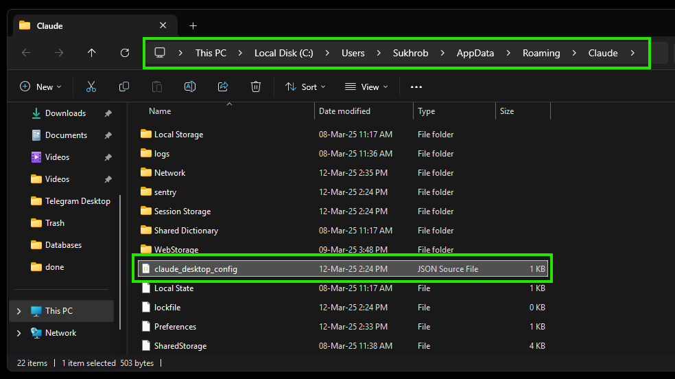

https://github.com/user-attachments/assets/028aa938-bc2d-400f-84a1-ae1000c8af9c

# MCP HEMIS Student

A Model Context Protocol (MCP) for accessing student information from the Higher Education Management Information System (HEMIS). This tool allows students to retrieve their academic information, schedules, grades, attendance, and other university-related data directly through Claude.

## Overview

This MCP provides a bridge between Claude and your university's HEMIS platform, enabling you to:
- View your personal student profile
- Check your grades and GPA
- Access your class schedule
- View attendance records
- Get subject details and available resources
- Access official documents and references
- View exam schedules
- Check contract information
- Get university statistics

## Installation

1. Install "Claude for Desktop" from [https://claude.ai/download](https://claude.ai/download).

2. Make sure you have Python 3.10 or higher installed.

3. Install `uv` (Python package manager):
```sh
# For macOS/Linux
curl -LsSf https://astral.sh/uv/install.sh | sh

# For Windows (powershell)
powershell -ExecutionPolicy ByPass -c "irm https://astral.sh/uv/install.ps1 | iex"
```

4. Clone this repository:
```sh
git clone https://github.com/sukhrobyangibaev/mcp_hemis_student.git
cd mcp_hemis_student
```

## Configuration

We’ll need to configure Claude for Desktop for whichever MCP servers you want to use. To do this, open your Claude for Desktop App configuration at:
- For Windows:
```
C:\Users\User\AppData\Roaming\Claude\claude_desktop_config.json
```



- For Mac:
```
~/Library/Application Support/Claude/claude_desktop_config.json
```


> [!NOTE]
> Make sure to create the file if it doesn’t exist.

Configure the Claude Desktop application to provide these environment variables:

```json
{
    "mcpServers": {
        "hemis": {
            "command": "uv",
            "args": [
                "--directory",
                "C:\\Users\\Sukhrob\\Documents\\Projects\\mcp_hemis_student",
                "run",
                "server.py"
            ],
            "env": {
                "HEMIS_API_BASE": "https://student.ubtuit.uz/rest/v1/",
                "HEMIS_LOGIN": "123412341234",
                "HEMIS_PASSWORD": "12345678"
            }
        }
    }
}
```

> [!NOTE]
> Use your own path, Hemis API base, login and password

> [!WARNING]
> You may need to put the full path to the uv executable in the command field. You can get this by running `which uv` on MacOS/Linux or `where uv` on Windows.

Save the file, and restart Claude for Desktop.

## Test with commands

Make sure Claude for Desktop is picking up the two tools we've exposed in our server. You can do this by looking for the hammer icon:


If the hammer icon has shown up, you can now test your server by running the following commands in Claude for Desktop, for example:
- "Show me my current GPA"
- "What classes do I have this week?"
- "Show me my attendance for Databases class"
- "What exams do I have this semester?"


## Available Tools

<details>
  <summary><b>Student Information</b></summary>
  
  - `get_student_profile()` - Get your personal and academic information
  - `get_student_gpa_list()` - Get your GPA information across academic years
  - `get_student_semesters()` - Get your semester information
</details>

<details>
  <summary><b>Academics</b></summary>
  
  - `get_student_subjects(semester)` - Get subjects and grades for a specific semester
  - `get_student_subjects_list(semester)` - Get subjects list without grades
  - `get_subject_details(subject, semester)` - Get detailed information about a specific subject
  - `get_student_attendance(subject, semester)` - Get attendance records for a specific subject
  - `get_student_performance(subject, semester)` - Get performance and task information
  - `get_student_resources(subject, semester)` - Get electronic resources for a subject
  - `get_student_task_list(semester)` - Get your list of tasks/assignments
  - `get_student_exams(semester)` - Get your exam schedule
</details>

<details>
  <summary><b>Schedule</b></summary>
  
  - `get_student_schedule(semester, week)` - Get your class schedule
</details>

<details>
  <summary><b>Documents & Contracts</b></summary>
  
  - `get_student_contract()` - Get your contract information for the current academic year
  - `get_student_contract_list()` - Get your list of contracts for all academic years
  - `get_student_documents()` - Get your official documents
  - `get_all_student_documents()` - Get all your official documents
  - `get_student_references()` - Get your official student references/certificates
  - `generate_student_reference()` - Generate a new student reference
  - `get_student_decrees()` - Get official orders/decrees related to you
</details>

<details>
  <summary><b>University Information</b></summary>
  
  - `get_employee_statistics()` - Get statistics about university employees
  - `get_university_structure()` - Get statistics about university structure
  - `get_student_statistics()` - Get statistics about university students
  - `get_universities()` - Get a list of universities using HEMIS system
  - `get_university_profile()` - Get profile information about university
</details>

## Running Client (for Advanced Users)

If you have an API key for Anthropic or OpenAI, you can run the clients as well.

1. Copy the `.env.example` file to `.env` and fill in the necessary keys.

2. In the project folder, run one of the following commands:

```sh
uv run client_claude.py server.py
# or
uv run client_openai.py server.py
```


## Security Note

Your HEMIS credentials are stored locally in your Claude configuration. They are not sent anywhere except to your university's HEMIS system for authentication.

## License

This project is licensed under the MIT License. See the [LICENSE](./LICENSE) file for more details.
